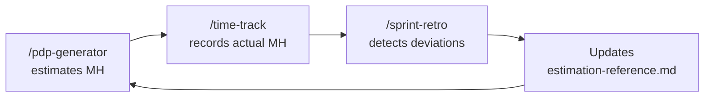

# Solo Founder SDLC Kit for Claude Code

<p align="center">
  
</p>

Complete kit of Skills, Agents, Hooks, and configuration for a
professional development workflow as a solo founder using Claude Code.

**Now distributed as a Claude Code plugin** — install once, use everywhere.

## What's Included

| #   | Component             | Type         | Purpose                                          |
| --- | --------------------- | ------------ | ------------------------------------------------ |
|     | **SKILLS**            |              |                                                  |
| 1   | /plan-feature         | Skill        | Plan features with user stories + acceptance criteria |
| 2   | /implement            | Skill        | Implement tasks from active plan                 |
| 3   | /test-verify          | Skill+fork   | Testing + build verification + biome             |
| 4   | /review-code          | Skill+fork   | Code review (verifies conventions)               |
| 5   | /commit-ship          | Skill        | Git + PR with pre-flight checks                  |
| 6   | /write-docs           | Skill        | Documentation                                    |
| 7   | /triage-bug           | Skill        | Bug diagnosis and classification                 |
| 8   | /write-spec           | Skill        | Formal spec for complex features (selective SDD) |
| 9   | /github-sync          | Skill        | Sync tasks/bugs with GitHub Issues               |
| 10  | /pdp-generator        | Skill        | Quotation: WBS + MH estimation + Excel           |
| 11  | /bootstrap-repo       | Skill+fork   | Quick repo onboarding                            |
| 12  | /log-decision         | Skill        | Automatic ADRs                                   |
| 13  | /sprint-retro         | Skill+fork   | Retrospective + continuous improvement           |
| 14  | /time-track           | Skill        | Actual vs. estimated hours                       |
|     | **COMMANDS**          |              |                                                  |
| 15  | /init-project         | Command      | Initialize project (CLAUDE.md, docs/, settings)  |
|     | **AGENTS**            |              |                                                  |
| 16  | qa-tester             | Agent        | Isolated QA (tests + build + lint)               |
| 17  | security-reviewer     | Agent        | Security audit (read-only)                       |
|     | **HOOKS**             |              |                                                  |
| 18  | File protection       | PreToolUse   | Blocks .env, .git, node_modules                  |
| 19  | Per-file Biome        | PostToolUse  | Auto-fix lint+format per file                    |
| 20  | Global Build + Biome  | Stop         | Full verification on finish                      |
| 21  | Notifications         | Stop/Notif   | macOS alerts on finish and input needed           |

## Installation

### As a Claude Code Plugin (recommended)

```bash
# Install from local clone:
git clone https://github.com/fcojaviergon/solo-founder-team.git
claude plugin add /path/to/solo-founder-team

# Or use directly without installing:
claude --plugin-dir /path/to/solo-founder-team
```

### Initialize your project

Inside Claude Code, run:

```
/init-project
```

This creates:
- `CLAUDE.md` — project constitution (edit with your stack and conventions)
- `.claude/settings.json` — safe project permissions
- `docs/` — active plan, decisions, bugs, timesheet
- `specs/` — for formal specifications

If `CLAUDE.md` already exists, `/init-project` will analyze your existing file,
report missing sections, and offer to add them without overwriting your content.

### Migrating from v1.x (install.sh)

If you previously installed via `npx` or `install.sh`:

1. Remove old skills: `rm -rf ~/.claude/skills/{plan-feature,implement,test-verify,review-code,commit-ship,write-docs,triage-bug,write-spec,github-sync,pdp-generator,bootstrap-repo,log-decision,sprint-retro,time-track}`
2. Remove old agents: `rm -f ~/.claude/agents/{qa-tester,security-reviewer}.md`
3. Remove hooks from `~/.claude/settings.json` (or restore a backup)
4. Install the plugin with one of the methods above
5. Run `/init-project` in each project

## How It Works

<p align="center">
  
</p>

### How Claude Code uses the kit

1. **You type a slash command** (e.g. `/plan-feature add search filter`)
2. **The plugin loads the skill** with specific steps, templates, and rules
3. **Hooks run automatically** — Biome formats on every edit, file protection blocks dangerous writes
4. **Agents run in isolation** — QA and security review don't pollute your main conversation context
5. **Project context** comes from `CLAUDE.md` (your conventions) + `.claude/skills/` (custom skills)

### PDP-driven development

When you start from a quotation, the PDP becomes the roadmap:

1. `/pdp-generator` analyzes requirements and creates a WBS with modules and estimated hours
2. For each module in the PDP:
   - **Complex** (10+ files, integrations) → `/write-spec @docs/pdp-project.md` → then `/plan-feature`
   - **Simple** (CRUD, UI) → `/plan-feature @docs/pdp-project.md` directly
3. `/time-track` logs actual hours per module to compare against PDP estimates
4. `/sprint-retro` detects deviations and feeds back into future PDPs

### GitHub Issues Integration (Optional)

The kit can optionally sync tasks and bugs with GitHub Issues. This is **opt-in per project**.

**How to enable:**

1. When you run `/plan-feature` or `/triage-bug`, Claude will ask: "Sync to GitHub Issues?"
2. If you accept, a `.github-issues` file is created in your project root
3. From then on, all skills automatically create/update/close GitHub issues

**What happens when enabled:**

| Skill           | GitHub action                             |
| --------------- | ----------------------------------------- |
| `/plan-feature` | Creates parent issue + one issue per task |
| `/write-spec`   | Creates epic issue for the spec           |
| `/implement`    | Comments progress on task issues          |
| `/commit-ship`  | Links PR with `Closes #NNN` to auto-close |
| `/triage-bug`   | Creates bug issues (auto for CRITICAL)    |
| `/github-sync`  | Manual sync, status check, bulk close     |

**Requirements:** [GitHub CLI](https://cli.github.com/) (`gh`) authenticated.

## Daily Usage

### Typical workflow

```
# Simple feature (< 10 files)
/plan-feature add search filter              # Plan
/implement                                    # Implement
/test-verify                                  # Verify
/commit-ship                                  # Ship

# Complex feature (10+ files, integrations, dense logic)
/write-spec payment system with Stripe        # Formal spec first
/plan-feature @specs/stripe-payments.md       # Plan from the spec
/implement                                    # Implement
/test-verify                                  # Verify
/review-code                                  # Review
/commit-ship                                  # Ship
```

### Useful commands

| What you want                  | What you type                             |
| ------------------------------ | ----------------------------------------- |
| Initialize project             | `/init-project`                           |
| New feature                    | `/plan-feature [description]`             |
| Implement                      | `/implement` or `/implement task 3`       |
| Test                           | `/test-verify`                            |
| Review                         | `/review-code`                            |
| Ship                           | `/commit-ship`                            |
| Bug                            | `/triage-bug [description]`               |
| Formal spec (complex features) | `/write-spec [description]`               |
| Quote a project                | `/pdp-generator [description]`            |
| Repo onboarding                | `/bootstrap-repo`                         |
| Log a decision                 | `/log-decision [what we decided]`         |
| Retrospective                  | `/sprint-retro`                           |
| Log hours                      | `/time-track 3h on auth module`           |
| Check hours progress           | `/time-track how much have we spent?`     |
| Document                       | `/write-docs [what to document]`          |
| Sync issues to GitHub          | `/github-sync push`                       |

## Plugin Architecture

```
solo-founder-team/                  <- PLUGIN
├── .claude-plugin/
│   └── plugin.json                 Plugin manifest
├── skills/                         14 reusable skills
│   ├── plan-feature/
│   ├── implement/
│   ├── test-verify/
│   ├── review-code/
│   ├── commit-ship/
│   ├── write-docs/
│   ├── triage-bug/
│   ├── write-spec/
│   ├── github-sync/
│   ├── pdp-generator/
│   │   ├── scripts/
│   │   ├── templates/
│   │   └── resources/
│   ├── bootstrap-repo/
│   ├── log-decision/
│   ├── sprint-retro/
│   └── time-track/
├── agents/                         2 isolated agents
│   ├── qa-tester.md
│   └── security-reviewer.md
├── hooks/
│   └── hooks.json                  Lifecycle hooks
├── scripts/                        Hook helper scripts
├── commands/
│   └── init-project.md             Project setup command
└── config/
    ├── CLAUDE.md.template          Project constitution template
    └── project-settings.json       Per-project permissions

my-project/                         <- YOUR PROJECT (after /init-project)
├── CLAUDE.md                       Project constitution
├── .claude/
│   ├── settings.json               Project permissions
│   └── skills/                     Skills specific to THIS repo
│       ├── my-frontend/            Your custom skill
│       └── my-backend/             Your custom skill
├── docs/
│   ├── active-plan.md
│   ├── timesheet.csv
│   ├── bugs-found.md
│   ├── decisions/
│   └── retros/
└── specs/
```

## The Feedback Loop



## Prerequisites

- Claude Code installed (Pro or Max recommended)
- Python 3 (for PDP Excel script)
- Optional: Biome (`npm install -D @biomejs/biome`) for auto-formatting hooks
- Optional: openpyxl (`pip install openpyxl`) for Excel generation
- Optional: [GitHub CLI](https://cli.github.com/) (`gh`) for GitHub Issues sync

## Notes

- Biome hooks are **no-op** if Biome is not installed — they won't break your workflow.
- macOS notifications use `osascript` and silently fail on Linux.
- Prettier is denied by default in project settings. If you need it, edit `.claude/settings.json`.
