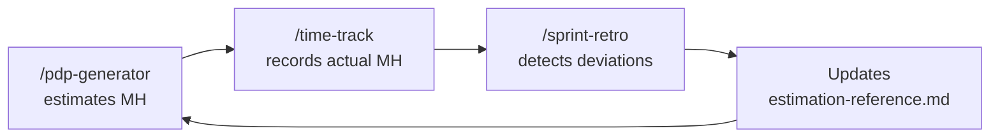

# Solo Founder SDLC Kit for Claude Code

<p align="center">
  
</p>

Complete kit of Skills, Agents, Hooks, and configuration for a
professional development workflow as a solo founder using Claude Code.

## What's Included

| #   | Component             | Type         | Purpose                                          |
| --- | --------------------- | ------------ | ------------------------------------------------ |
|     | **CONFIG**            |              |                                                  |
| 1   | CLAUDE.md template    | Config       | Project constitution                             |
| 2   | global-settings.json  | Config       | Hooks (Biome, build, protection, notifications)  |
| 3   | project-settings.json | Config       | Safe per-project permissions                     |
|     | **SDLC SKILLS**       |              |                                                  |
| 4   | /plan-feature         | Skill        | Plan features with actionable plan               |
| 5   | /implement            | Skill        | Implement tasks (references custom skills)       |
| 6   | /test-verify          | Skill+fork   | Testing + build verification + biome             |
| 7   | /review-code          | Skill+fork   | Code review (verifies conventions)               |
| 8   | /commit-ship          | Skill        | Git + PR with pre-flight checks                  |
| 9   | /write-docs           | Skill        | Documentation                                    |
| 10  | /triage-bug           | Skill        | Bug diagnosis and classification                 |
| 11  | /write-spec           | Skill        | Formal spec for complex features (selective SDD) |
| 12  | /github-sync          | Skill        | Sync tasks/bugs with GitHub Issues               |
|     | **BUSINESS SKILLS**   |              |                                                  |
| 13  | /pdp-generator        | Skill        | Quotation: WBS + MH estimation + Excel           |
| 14  | /bootstrap-repo       | Skill+fork   | Quick repo onboarding                            |
| 15  | /log-decision         | Skill        | Automatic ADRs                                   |
| 16  | /sprint-retro         | Skill+fork   | Retrospective + continuous improvement           |
| 17  | /time-track           | Skill        | Actual vs. estimated hours                       |
|     | **AGENTS**            |              |                                                  |
| 18  | qa-tester             | Agent        | Isolated QA (tests + build + lint)               |
| 19  | security-reviewer     | Agent        | Security audit (read-only)                       |
|     | **HOOKS**             |              |                                                  |
| 20  | File protection       | PreToolUse   | Blocks .env, .git, node_modules                  |
| 21  | Per-file Biome        | PostToolUse  | Auto-fix lint+format per file                    |
| 22  | Global Build + Biome  | Stop         | Full verification on finish                      |
| 23  | Stop notification     | Stop         | macOS alert on finish                            |
| 24  | Input notification    | Notification | Alert when waiting for input                     |
| 25  | Session logging       | Stop         | Log for time tracking                            |

## Installation

### Option A: npx (recommended)

```bash
# Install global skills, agents, and hooks:
npx github:fcojaviergon/solo-founder-team

# Configure a project:
cd /path/to/your/project
npx github:fcojaviergon/solo-founder-team init
```

### Option B: curl (no Node.js required)

```bash
# Install globals:
curl -fsSL https://raw.githubusercontent.com/fcojaviergon/solo-founder-team/main/remote-install.sh | bash

# Configure a project:
cd /path/to/your/project
curl -fsSL https://raw.githubusercontent.com/fcojaviergon/solo-founder-team/main/remote-install.sh | bash -s -- init
```

### Updating

```bash
# Check your installed version:
npx github:fcojaviergon/solo-founder-team --version

# Update to the latest version:
npx github:fcojaviergon/solo-founder-team update
```

The update command re-installs all global skills, agents, and hooks while showing you the version change (e.g. `v1.0.0 → v1.1.0`). Project files (`CLAUDE.md`, `.claude/settings.json`) are NOT overwritten during update.

### Option C: Git clone (for development/customization)

```bash
git clone https://github.com/fcojaviergon/solo-founder-team.git
cd solo-founder-team
./install.sh
```

### What it installs

**Global** (`~/.claude/`):

- 13 global skills in `~/.claude/skills/`
- 2 agents in `~/.claude/agents/`
- Hooks and settings in `~/.claude/settings.json`

**Per project** (with `init`):

- `CLAUDE.md` (template to edit)
- `.claude/settings.json` (project permissions)
- `docs/` (documentation structure)

### Step 3: Edit CLAUDE.md

Open `CLAUDE.md` and replace the `[PLACEHOLDERS]` with your stack and conventions.

### Step 4: Add your custom skills (optional)

If you have frontend/backend skills specific to your project:

```bash
mkdir -p .claude/skills/my-frontend
# Copy your SKILL.md there
mkdir -p .claude/skills/my-backend
# Copy your SKILL.md there
```

## How It Works

<p align="center">
  
</p>

### How Claude Code uses the kit

1. **You type a slash command** (e.g. `/plan-feature add search filter`)
2. **Claude Code loads the skill** from `~/.claude/skills/plan-feature/SKILL.md`
3. **The skill instructs Claude** with specific steps, templates, and rules
4. **Hooks run automatically** — Biome formats on every edit, file protection blocks dangerous writes
5. **Agents run in isolation** — QA and security review don't pollute your main conversation context
6. **Project context** comes from `CLAUDE.md` (your conventions) + `.claude/skills/` (custom skills)

### PDP-driven development

When you start from a quotation, the PDP becomes the roadmap:

1. `/pdp-generator` analyzes requirements and creates a WBS with modules and estimated hours
2. For each module in the PDP:
   - **Complex** (10+ files, integrations) → `/write-spec @docs/pdp-project.md` → then `/plan-feature`
   - **Simple** (CRUD, UI) → `/plan-feature @docs/pdp-project.md` directly
3. `/time-track` logs actual hours per module to compare against PDP estimates
4. `/sprint-retro` detects deviations and feeds back into future PDPs

### GitHub Issues Integration (Optional)

The kit can optionally sync tasks and bugs with GitHub Issues. This is **opt-in per project**.

**How to enable:**

1. When you run `/plan-feature` or `/triage-bug`, Claude will ask: "Sync to GitHub Issues?"
2. If you accept, a `.github-issues` file is created in your project root
3. From then on, all skills automatically create/update/close GitHub issues

**What happens when enabled:**

| Skill           | GitHub action                             |
| --------------- | ----------------------------------------- |
| `/plan-feature` | Creates parent issue + one issue per task |
| `/write-spec`   | Creates epic issue for the spec           |
| `/implement`    | Comments progress on task issues          |
| `/commit-ship`  | Links PR with `Closes #NNN` to auto-close |
| `/triage-bug`   | Creates bug issues (auto for CRITICAL)    |
| `/github-sync`  | Manual sync, status check, bulk close     |

**Tracking format** — issue numbers are stored as HTML comments in your markdown files:

```markdown
1. [ ] Add search UI — src/components/ <!-- gh:#101 -->
2. [x] Create API endpoint — src/api/ <!-- gh:#102 -->
```

**To disable:** set `.github-issues` content to `disabled`.

**Requirements:** [GitHub CLI](https://cli.github.com/) (`gh`) authenticated.

## Daily Usage

### Typical workflow

```
# Simple feature (< 10 files)
/plan-feature add search filter              # Plan
/implement                                    # Implement
/test-verify                                  # Verify
/commit-ship                                  # Ship

# Complex feature (10+ files, integrations, dense logic)
/write-spec payment system with Stripe        # Formal spec first
/plan-feature @specs/stripe-payments.md       # Plan from the spec
/implement                                    # Implement (optional subagents)
/test-verify                                  # Verify
/review-code                                  # Review
/commit-ship                                  # Ship
```

### Useful commands

| What you want                  | What you type                                         |
| ------------------------------ | ----------------------------------------------------- |
| New feature                    | `/plan-feature [description]`                         |
| Implement                      | `/implement` or `/implement task 3`                   |
| Test                           | `/test-verify`                                        |
| Review                         | `/review-code`                                        |
| Ship                           | `/commit-ship`                                        |
| Bug                            | `/triage-bug [description]`                           |
| Formal spec (complex features) | `/write-spec [description]`                           |
| Quote a project                | `/pdp-generator [description]`                        |
| Repo onboarding                | `/bootstrap-repo`                                     |
| Log a decision                 | `/log-decision [what we decided]`                     |
| Retrospective                  | `/sprint-retro`                                       |
| Log hours                      | `/time-track 3h on auth module`                       |
| Check hours progress           | `/time-track how much have we spent?`                 |
| Document                       | `/write-docs [what to document]`                      |
| Sync issues to GitHub          | `/github-sync push`                                   |
| Check issue sync status        | `/github-sync status`                                 |
| Close completed issues         | `/github-sync close-done`                             |
| Update kit                     | `npx github:fcojaviergon/solo-founder-team update`    |
| Check version                  | `npx github:fcojaviergon/solo-founder-team --version` |

## Use Cases

### 1. Building a SaaS MVP from scratch

You have a new idea and want to go from zero to deployed MVP:

```bash
# Day 1: Setup & Planning
npx github:fcojaviergon/solo-founder-team init     # Setup the kit in your project
/bootstrap-repo                                      # Get an overview of the current state
/plan-feature user authentication with email+password # Plan the first feature

# Day 1-2: Implement the plan
/implement                                           # Picks up first story from active-plan.md
/implement                                           # Next story...
/test-verify                                         # Run tests + build + lint
/commit-ship                                         # Commit with conventional message + PR

# Day 3: Next feature
/plan-feature subscription billing with Stripe
/implement
/test-verify
/review-code                                         # Security check before shipping payments
/commit-ship

# End of week
/sprint-retro                                        # What went well? What to improve?
```

### 2. Quoting a client project (freelancer/agency)

A client sends you requirements and you need a professional quotation:

```bash
# Analyze their existing repo (if they have one)
/bootstrap-repo                                      # Architecture summary in 2 minutes

# Generate the PDP with WBS and hour estimates
/pdp-generator e-commerce with inventory, payments, and admin panel

# Output: docs/pdp-ecommerce.md with:
#   - Module breakdown (auth, catalog, cart, checkout, admin)
#   - Tasks per module with MH estimates
#   - Risk analysis and assumptions
#   - Excel file ready for the client proposal

# Later, when the project starts:
/plan-feature @docs/pdp-ecommerce.md                 # Transform PDP into user stories
/time-track 4h on auth module                        # Track actual hours vs estimates
/time-track how much have we spent?                  # Compare against PDP budget
```

### 3. Handling a production bug

Something breaks in production at 2 AM:

```bash
# Report the bug
/triage-bug users can't checkout — getting 500 on /api/checkout

# Claude will:
#   1. Search the codebase for the checkout endpoint
#   2. Identify the root cause (e.g. null pointer on discount code)
#   3. Classify severity (CRITICAL — affects all users)
#   4. Fix it immediately (CRITICAL = no waiting)
#   5. Run tests + build

/commit-ship                                         # Ship the fix
# → Creates PR with "fix(checkout): handle null discount code"

# Log a decision if needed
/log-decision removed optional discount field from checkout to prevent null errors
```

### 4. Complex feature with spec-first approach

Building something that touches many files and has integrations:

```bash
# Step 1: Write a formal specification
/write-spec real-time notifications with WebSocket, email, and push

# Output: specs/real-time-notifications.md with:
#   - System design, data flow diagram
#   - API contracts, WebSocket events
#   - Acceptance criteria per scenario
#   - Edge cases and error handling

# Step 2: Plan from the spec
/plan-feature @specs/real-time-notifications.md

# Step 3: Implement story by story
/implement                                           # Story 1: WebSocket server setup
/test-verify
/implement                                           # Story 2: Notification service
/test-verify
/implement                                           # Story 3: Email integration
/review-code                                         # Full review before merging
/commit-ship
```

### 5. Onboarding to an inherited codebase

You join a project or pick up a repo you haven't touched in months:

```bash
/bootstrap-repo
# Output:
#   - Stack: Next.js 14, Prisma, PostgreSQL, Tailwind
#   - Architecture: App Router, server actions, clean separation
#   - 847 files, 42 components, 12 API routes
#   - DB: 15 tables, migrations up to date
#   - Tests: 23 test files, vitest, ~60% coverage
#   - Issues: 3 TODOs, 1 FIXME, no HACK markers

# Now you have full context to start working
/plan-feature add multi-language support
```

### 6. End-to-end SDLC with GitHub Issues

Full traceability from planning to deployment:

```bash
# Plan creates GitHub issues automatically
/plan-feature user profile with avatar upload
# → Creates parent issue #45 + child issues #46, #47, #48

# Implementation links to issues
/implement                                           # Comments on #46: "Starting implementation"
/test-verify                                         # Agent runs isolated QA
/commit-ship                                         # PR body includes "Closes #46"

# Check sync status anytime
/github-sync status
# → #45 open (2/3 tasks done), #46 closed, #47 closed, #48 open

# Bulk close completed tasks
/github-sync close-done
```

### 7. Logging decisions for your future self

Record why you made important technical choices:

```bash
/log-decision chose Resend over SendGrid for transactional emails
# Output: docs/decisions/2025-06-15-resend-over-sendgrid.md
#   - Problem: Need transactional email service
#   - Options: SendGrid (mature, complex), Resend (modern, simpler DX)
#   - Decision: Resend — better DX, React Email support, sufficient for our scale
#   - Consequences: Locked to Resend API, need migration plan if we outgrow

/log-decision use server actions instead of API routes for mutations
```

### 8. Weekly retrospective and continuous improvement

At the end of each sprint or week:

```bash
/sprint-retro
# Claude analyzes:
#   - git log from the past week
#   - active-plan.md progress (completed vs planned)
#   - Recent decisions and bugs
#   - TODOs/FIXMEs introduced
#
# Output: docs/retros/2025-06-20-retro.md
#   - What was done: 5 stories completed, 1 bug fixed
#   - What went well: Auth module shipped ahead of estimate
#   - What went wrong: Image upload took 2x estimated time
#   - Action items: Add "file upload" multiplier to estimates
#   - CLAUDE.md updates: "Always use presigned URLs for uploads"

/time-track hours report                             # Compare actual vs estimated
```

### 9. Custom project skills

Add project-specific skills for your stack:

```bash
# Create a frontend skill for your design system
mkdir -p .claude/skills/my-frontend

# .claude/skills/my-frontend/SKILL.md
# ---
# name: my-frontend
# description: Frontend conventions for this project
# ---
# - Use shadcn/ui components, never raw HTML
# - All pages use the AppLayout wrapper
# - Forms use react-hook-form + zod validation
# - Colors from design tokens only (no hardcoded hex)

# Now /implement automatically loads your conventions
/implement                                           # Reads your custom skill first
```

### Agents: When and how they activate

Agents are **not invoked directly** — they're used by skills behind the scenes:

| Agent               | Used by        | What it does                                  |
| ------------------- | -------------- | --------------------------------------------- |
| `qa-tester`         | `/test-verify` | Runs tests, build, and lint in an isolated context |
| `security-reviewer` | `/review-code` | Scans for vulnerabilities (read-only, can't modify code) |

Skills with `context: fork` run agents in a **separate context**, so heavy analysis doesn't pollute your main conversation. The agent does its work and returns a summary.

## Architecture

```
~/.claude/                        <- GLOBAL (all projects)
├── settings.json                 Hooks + global config
├── skills/                       Reusable skills
│   ├── plan-feature/
│   ├── implement/
│   ├── test-verify/
│   ├── review-code/
│   ├── commit-ship/
│   ├── write-docs/
│   ├── triage-bug/
│   ├── write-spec/
│   ├── pdp-generator/
│   │   ├── scripts/
│   │   ├── templates/
│   │   └── resources/
│   ├── bootstrap-repo/
│   ├── log-decision/
│   ├── sprint-retro/
│   └── time-track/
└── agents/
    ├── qa-tester.md
    └── security-reviewer.md

my-project/                       <- PER PROJECT
├── CLAUDE.md                     Project constitution
├── .claude/
│   ├── settings.json             Project permissions
│   └── skills/                   Skills specific to THIS repo
│       ├── my-frontend/          <- Your custom skill
│       └── my-backend/           <- Your custom skill
└── docs/
    ├── active-plan.md
    ├── architecture.md
    ├── repo-overview.md
    ├── timesheet.csv
    ├── bugs-found.md
    ├── decisions/
    │   └── README.md
    └── retros/
```

## The Feedback Loop



## Prerequisites

- Claude Code installed (Pro or Max recommended)
- Node.js + npm
- Biome: `npm install -D @biomejs/biome`
- Python 3 (for PDP Excel script)
- jq (for hooks): `brew install jq`
- openpyxl (for Excel): `pip install openpyxl`

## Notes

- Biome hooks assume you use Biome. If you use ESLint/Prettier,
  edit global-settings.json and change the commands.
- Notifications use `osascript` (macOS). On Linux, replace with
  `notify-send`.
- Prettier is denied by default. If you need it, remove it from
  project-settings.json.
