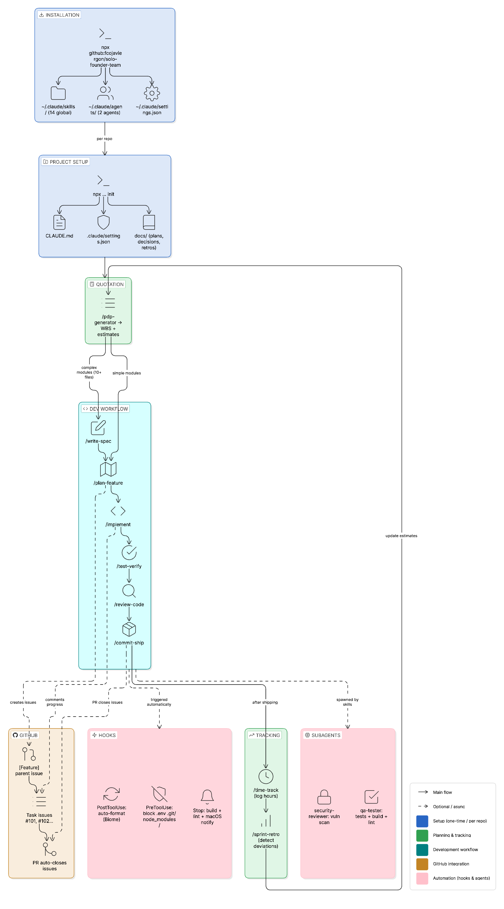
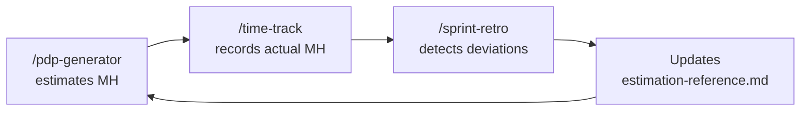

# Solo Founder SDLC Kit for Claude Code

<p align="center">
  
</p>

Complete kit of Skills, Agents, Hooks, and configuration for a
professional development workflow as a solo founder using Claude Code.

## What's Included

| #   | Component             | Type         | Purpose                                          |
| --- | --------------------- | ------------ | ------------------------------------------------ |
|     | **CONFIG**            |              |                                                  |
| 1   | CLAUDE.md template    | Config       | Project constitution                             |
| 2   | global-settings.json  | Config       | Hooks (Biome, build, protection, notifications)  |
| 3   | project-settings.json | Config       | Safe per-project permissions                     |
|     | **SDLC SKILLS**       |              |                                                  |
| 4   | /plan-feature         | Skill        | Plan features with actionable plan               |
| 5   | /implement            | Skill        | Implement tasks (references custom skills)       |
| 6   | /test-verify          | Skill+fork   | Testing + build verification + biome             |
| 7   | /review-code          | Skill+fork   | Code review (verifies conventions)               |
| 8   | /commit-ship          | Skill        | Git + PR with pre-flight checks                  |
| 9   | /write-docs           | Skill        | Documentation                                    |
| 10  | /triage-bug           | Skill        | Bug diagnosis and classification                 |
| 11  | /write-spec           | Skill        | Formal spec for complex features (selective SDD) |
| 12  | /github-sync          | Skill        | Sync tasks/bugs with GitHub Issues               |
|     | **BUSINESS SKILLS**   |              |                                                  |
| 13  | /pdp-generator        | Skill        | Quotation: WBS + MH estimation + Excel           |
| 14  | /bootstrap-repo       | Skill+fork   | Quick repo onboarding                            |
| 15  | /log-decision         | Skill        | Automatic ADRs                                   |
| 16  | /sprint-retro         | Skill+fork   | Retrospective + continuous improvement           |
| 17  | /time-track           | Skill        | Actual vs. estimated hours                       |
|     | **AGENTS**            |              |                                                  |
| 18  | qa-tester             | Agent        | Isolated QA (tests + build + lint)               |
| 19  | security-reviewer     | Agent        | Security audit (read-only)                       |
|     | **HOOKS**             |              |                                                  |
| 20  | File protection       | PreToolUse   | Blocks .env, .git, node_modules                  |
| 21  | Per-file Biome        | PostToolUse  | Auto-fix lint+format per file                    |
| 22  | Global Build + Biome  | Stop         | Full verification on finish                      |
| 23  | Stop notification     | Stop         | macOS alert on finish                            |
| 24  | Input notification    | Notification | Alert when waiting for input                     |
| 25  | Session logging       | Stop         | Log for time tracking                            |

## Installation

### Option A: npx (recommended)

```bash
# Install global skills, agents, and hooks:
npx github:fcojaviergon/solo-founder-team

# Configure a project:
cd /path/to/your/project
npx github:fcojaviergon/solo-founder-team init
```

### Option B: curl (no Node.js required)

```bash
# Install globals:
curl -fsSL https://raw.githubusercontent.com/fcojaviergon/solo-founder-team/main/remote-install.sh | bash

# Configure a project:
cd /path/to/your/project
curl -fsSL https://raw.githubusercontent.com/fcojaviergon/solo-founder-team/main/remote-install.sh | bash -s -- init
```

### Updating

```bash
# Check your installed version:
npx github:fcojaviergon/solo-founder-team --version

# Update to the latest version:
npx github:fcojaviergon/solo-founder-team update
```

The update command re-installs all global skills, agents, and hooks while showing you the version change (e.g. `v1.0.0 → v1.1.0`). Project files (`CLAUDE.md`, `.claude/settings.json`) are NOT overwritten during update.

### Option C: Git clone (for development/customization)

```bash
git clone https://github.com/fcojaviergon/solo-founder-team.git
cd solo-founder-team
./install.sh
```

### What it installs

**Global** (`~/.claude/`):

- 13 global skills in `~/.claude/skills/`
- 2 agents in `~/.claude/agents/`
- Hooks and settings in `~/.claude/settings.json`

**Per project** (with `init`):

- `CLAUDE.md` (template to edit)
- `.claude/settings.json` (project permissions)
- `docs/` (documentation structure)

### Step 3: Edit CLAUDE.md

Open `CLAUDE.md` and replace the `[PLACEHOLDERS]` with your stack and conventions.

### Step 4: Add your custom skills (optional)

If you have frontend/backend skills specific to your project:

```bash
mkdir -p .claude/skills/my-frontend
# Copy your SKILL.md there
mkdir -p .claude/skills/my-backend
# Copy your SKILL.md there
```

## How It Works

<p align="center">
  
</p>

### How Claude Code uses the kit

1. **You type a slash command** (e.g. `/plan-feature add search filter`)
2. **Claude Code loads the skill** from `~/.claude/skills/plan-feature/SKILL.md`
3. **The skill instructs Claude** with specific steps, templates, and rules
4. **Hooks run automatically** — Biome formats on every edit, file protection blocks dangerous writes
5. **Agents run in isolation** — QA and security review don't pollute your main conversation context
6. **Project context** comes from `CLAUDE.md` (your conventions) + `.claude/skills/` (custom skills)

### PDP-driven development

When you start from a quotation, the PDP becomes the roadmap:

1. `/pdp-generator` analyzes requirements and creates a WBS with modules and estimated hours
2. For each module in the PDP:
   - **Complex** (10+ files, integrations) → `/write-spec @docs/pdp-project.md` → then `/plan-feature`
   - **Simple** (CRUD, UI) → `/plan-feature @docs/pdp-project.md` directly
3. `/time-track` logs actual hours per module to compare against PDP estimates
4. `/sprint-retro` detects deviations and feeds back into future PDPs

### GitHub Issues Integration (Optional)

The kit can optionally sync tasks and bugs with GitHub Issues. This is **opt-in per project**.

**How to enable:**

1. When you run `/plan-feature` or `/triage-bug`, Claude will ask: "Sync to GitHub Issues?"
2. If you accept, a `.github-issues` file is created in your project root
3. From then on, all skills automatically create/update/close GitHub issues

**What happens when enabled:**

| Skill           | GitHub action                             |
| --------------- | ----------------------------------------- |
| `/plan-feature` | Creates parent issue + one issue per task |
| `/write-spec`   | Creates epic issue for the spec           |
| `/implement`    | Comments progress on task issues          |
| `/commit-ship`  | Links PR with `Closes #NNN` to auto-close |
| `/triage-bug`   | Creates bug issues (auto for CRITICAL)    |
| `/github-sync`  | Manual sync, status check, bulk close     |

**Tracking format** — issue numbers are stored as HTML comments in your markdown files:

```markdown
1. [ ] Add search UI — src/components/ <!-- gh:#101 -->
2. [x] Create API endpoint — src/api/ <!-- gh:#102 -->
```

**To disable:** set `.github-issues` content to `disabled`.

**Requirements:** [GitHub CLI](https://cli.github.com/) (`gh`) authenticated.

## Daily Usage

### Typical workflow

```
# Simple feature (< 10 files)
/plan-feature add search filter              # Plan
/implement                                    # Implement
/test-verify                                  # Verify
/commit-ship                                  # Ship

# Complex feature (10+ files, integrations, dense logic)
/write-spec payment system with Stripe        # Formal spec first
/plan-feature @specs/stripe-payments.md       # Plan from the spec
/implement                                    # Implement (optional subagents)
/test-verify                                  # Verify
/review-code                                  # Review
/commit-ship                                  # Ship
```

### Useful commands

| What you want                  | What you type                                         |
| ------------------------------ | ----------------------------------------------------- |
| New feature                    | `/plan-feature [description]`                         |
| Implement                      | `/implement` or `/implement task 3`                   |
| Test                           | `/test-verify`                                        |
| Review                         | `/review-code`                                        |
| Ship                           | `/commit-ship`                                        |
| Bug                            | `/triage-bug [description]`                           |
| Formal spec (complex features) | `/write-spec [description]`                           |
| Quote a project                | `/pdp-generator [description]`                        |
| Repo onboarding                | `/bootstrap-repo`                                     |
| Log a decision                 | `/log-decision [what we decided]`                     |
| Retrospective                  | `/sprint-retro`                                       |
| Log hours                      | `/time-track 3h on auth module`                       |
| Check hours progress           | `/time-track how much have we spent?`                 |
| Document                       | `/write-docs [what to document]`                      |
| Sync issues to GitHub          | `/github-sync push`                                   |
| Check issue sync status        | `/github-sync status`                                 |
| Close completed issues         | `/github-sync close-done`                             |
| Update kit                     | `npx github:fcojaviergon/solo-founder-team update`    |
| Check version                  | `npx github:fcojaviergon/solo-founder-team --version` |

## Architecture

```
~/.claude/                        <- GLOBAL (all projects)
├── settings.json                 Hooks + global config
├── skills/                       Reusable skills
│   ├── plan-feature/
│   ├── implement/
│   ├── test-verify/
│   ├── review-code/
│   ├── commit-ship/
│   ├── write-docs/
│   ├── triage-bug/
│   ├── write-spec/
│   ├── pdp-generator/
│   │   ├── scripts/
│   │   ├── templates/
│   │   └── resources/
│   ├── bootstrap-repo/
│   ├── log-decision/
│   ├── sprint-retro/
│   └── time-track/
└── agents/
    ├── qa-tester.md
    └── security-reviewer.md

my-project/                       <- PER PROJECT
├── CLAUDE.md                     Project constitution
├── .claude/
│   ├── settings.json             Project permissions
│   └── skills/                   Skills specific to THIS repo
│       ├── my-frontend/          <- Your custom skill
│       └── my-backend/           <- Your custom skill
└── docs/
    ├── active-plan.md
    ├── architecture.md
    ├── repo-overview.md
    ├── timesheet.csv
    ├── bugs-found.md
    ├── decisions/
    │   └── README.md
    └── retros/
```

## The Feedback Loop



## Prerequisites

- Claude Code installed (Pro or Max recommended)
- Node.js + npm
- Biome: `npm install -D @biomejs/biome`
- Python 3 (for PDP Excel script)
- jq (for hooks): `brew install jq`
- openpyxl (for Excel): `pip install openpyxl`

## Notes

- Biome hooks assume you use Biome. If you use ESLint/Prettier,
  edit global-settings.json and change the commands.
- Notifications use `osascript` (macOS). On Linux, replace with
  `notify-send`.
- Prettier is denied by default. If you need it, remove it from
  project-settings.json.
