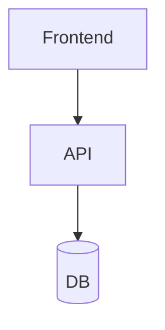

# Plan de Desarrollo de Producto (PDP)
## [Nombre del Proyecto]

**Fecha**: [fecha]  
**Preparado por**: [nombre]  
**Versión**: 1.0  
**Estado**: Borrador

---

## 1. Resumen Ejecutivo

[Qué es, para quién, qué problema resuelve, esfuerzo estimado en HH y semanas]

---

## 2. Alcance

### In Scope
- [funcionalidad 1]

### ⚠️ Out of Scope
- [exclusión 1]

### Supuestos
- [supuesto 1]

---

## 3. Arquitectura Propuesta

| Capa | Tecnología |
|------|------------|
| Frontend | |
| Backend | |
| DB | |
| Infra | |
| CI/CD | |

---

## 4. WBS

| ID | Módulo | Tarea | Tipo | Complejidad | HH | Perfil | Riesgo |
|----|--------|-------|------|-------------|-----|--------|--------|

---

## 5. Resumen de Estimación

### Por Módulo
| Módulo | HH | % |
|--------|-----|---|

### Totales
| Concepto | HH |
|----------|-----|
| Subtotal | |
| Buffer (%) | |
| **TOTAL** | |

---

## 6. Cronograma

| Semana | Actividad | HH |
|--------|-----------|-----|

---

## 7. Equipo Sugerido

| Perfil | Dedicación | Período |
|--------|-----------|---------|

---

## 8. Riesgos

| Riesgo | Probabilidad | Impacto | Mitigación |
|--------|-------------|---------|------------|

---

## 9. Exclusiones y Condiciones

1. Estimaciones asumen APIs de terceros documentadas
2. No incluye migración de datos legacy
3. Cambios de alcance requieren re-estimación
4. UAT es responsabilidad del cliente
