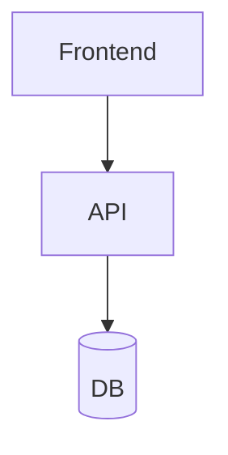

# Product Development Plan (PDP)
## [Project Name]

**Date**: [date]
**Prepared by**: [name]
**Version**: 1.0
**Status**: Draft

---

## 1. Executive Summary

[What it is, who it's for, what problem it solves, estimated effort in MH and weeks]

---

## 2. Scope

### In Scope
- [feature 1]

### Out of Scope
- [exclusion 1]

### Assumptions
- [assumption 1]

---

## 3. Proposed Architecture

| Layer | Technology |
|-------|------------|
| Frontend | |
| Backend | |
| DB | |
| Infra | |
| CI/CD | |

---

## 4. WBS

| ID | Module | Task | Type | Complexity | MH | Profile | Risk |
|----|--------|------|------|------------|-----|---------|------|

---

## 5. Estimation Summary

### By Module
| Module | MH | % |
|--------|-----|---|

### Totals
| Concept | MH |
|---------|-----|
| Subtotal | |
| Buffer (%) | |
| **TOTAL** | |

---

## 6. Timeline

| Week | Activity | MH |
|------|----------|-----|

---

## 7. Suggested Team

| Profile | Dedication | Period |
|---------|-----------|--------|

---

## 8. Risks

| Risk | Probability | Impact | Mitigation |
|------|------------|--------|------------|

---

## 9. Exclusions and Conditions

1. Estimates assume documented third-party APIs
2. Does not include legacy data migration
3. Scope changes require re-estimation
4. UAT is the client's responsibility
